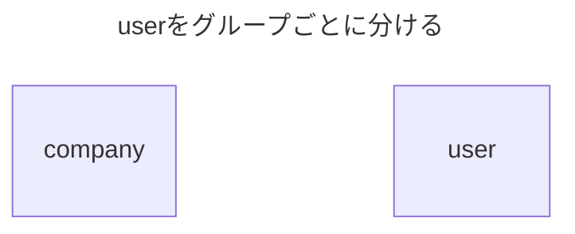
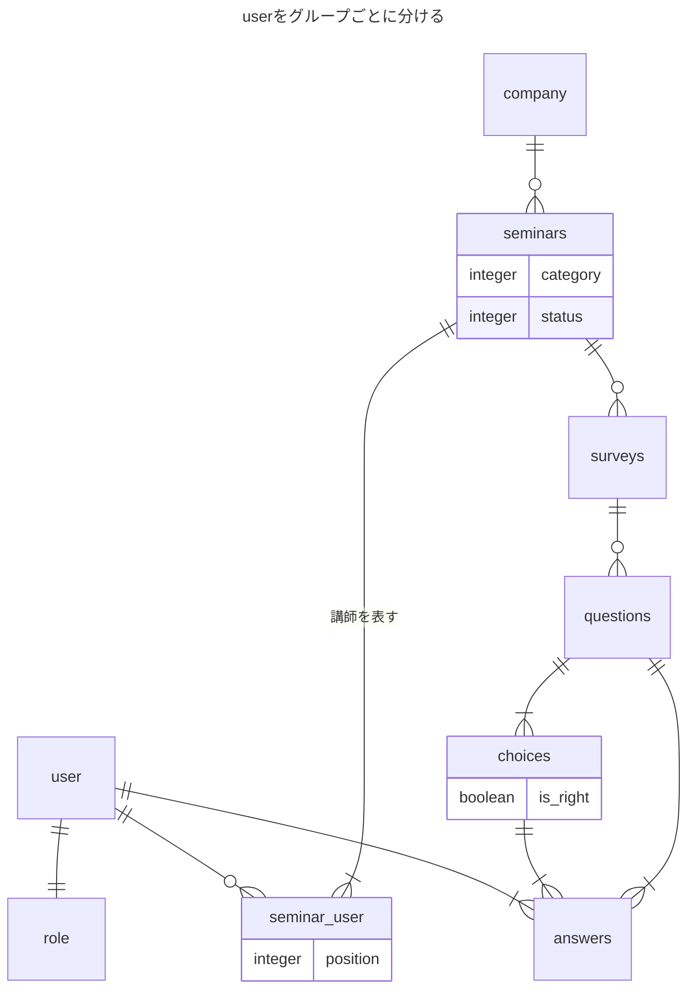
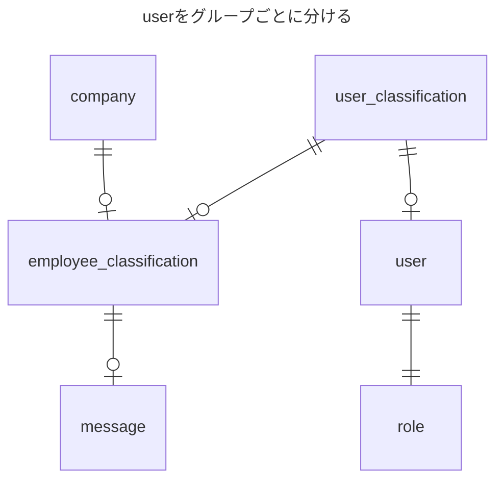

復習:
中間テーブルを設ける理由は、中間テーブルを設けないケースを考えるとわかりやすい。
1対nの関係性の場合、1の方はカラムが1つで、nの方はn個のレコードを設ける。
n対nの場合で中間テーブルがない場合、レコードの重複を許容しないテーブルの場合、対応するn個分のカラムを用意する必要がある。
カラムの不足が生じる可能性あり、作りすぎると余剰が発生しnullが発生するため、中間テーブルを設けたほうがよい。
```
CREATE TABLE company (
  id INT PRIMARY KEY,
  name VARCHAR(255),
  address VARCHAR(255),
  phone_number VARCHAR(20)
);

CREATE TABLE seminar (
  id INT PRIMARY KEY,
  title VARCHAR(255),
  date DATE,
  company_id INT,
  FOREIGN KEY (company_id) REFERENCES company(id) ON DELETE CASCADE
);

INSERT INTO company (id, name, address, phone_number)
VALUES
  (1, 'Company A', 'Address A', 'Phone Number A'),
  (2, 'Company B', 'Address B', 'Phone Number B'),
  (3, 'Company C', 'Address C', 'Phone Number C'),
  (4, 'Company D', 'Address D', 'Phone Number D'),
  (5, 'Company E', 'Address E', 'Phone Number E');

INSERT INTO seminar (id, title, date, company_id)
SELECT
  ROW_NUMBER() OVER () AS id,
  CONCAT('Seminar ', ROW_NUMBER() OVER ()) AS title,
  CURRENT_DATE + INTERVAL FLOOR(RAND() * 30) DAY AS date,
  FLOOR(RAND() * 5) + 1 AS company_id
FROM
  (SELECT 1 UNION ALL SELECT 2 UNION ALL SELECT 3 UNION ALL SELECT 4 UNION ALL SELECT 5) AS c
CROSS JOIN
  (SELECT 1 UNION ALL SELECT 2 UNION ALL SELECT 3 UNION ALL SELECT 4 UNION ALL SELECT 5) AS s
CROSS JOIN
  (SELECT 1 UNION ALL SELECT 2 UNION ALL SELECT 3 UNION ALL SELECT 4 UNION ALL SELECT 5) AS t
LIMIT 100;

```
```

```