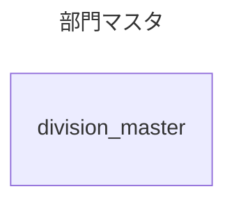
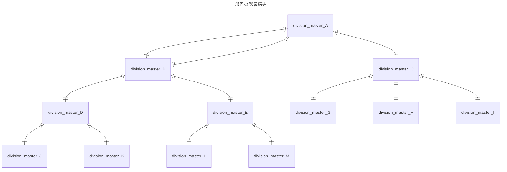

多対多の関係で



```
CREATE TABLE division_master (
  id INT AUTO_INCREMENT PRIMARY KEY NOT NULL,
  division_id INT NOT NULL,
  name VARCHAR(255) NOT NULL,
  hierarchy INT NOT NULL,
  division_master_id INT,
  FOREIGN KEY (division_master_id) REFERENCES division_master(id)
);

INSERT INTO division_master (division_id, name, hierarchy, division_master_id)
VALUES
  (10000, '全社', 3, null),
  (11000, '営業本部', 2, 1),
  (12000, '管理本部', 2, 1),
  (11100, '東日本営業部', 1, 2),
  (11200, '西日本営業部', 1, 2),
  (11101, '営業1課', 0, 4),
  (11102, '営業2課', 0, 4),
  (11103, '営業3課', 0, 5),
  (11104, '営業4課', 0, 5);

CREATE TABLE sales (
  id INT AUTO_INCREMENT PRIMARY KEY NOT NULL,
  division_master_id INT NOT NULL,
  sale_date DATE NOT NULL,
  amount INT NOT NULL,
  FOREIGN KEY (division_master_id) REFERENCES division_master(id) ON DELETE CASCADE
);

INSERT INTO sales (division_master_id, sale_date, amount)
SELECT 
  FLOOR(RAND() * 4) + 6,
  DATE_ADD('2023-01-01', INTERVAL FLOOR(RAND() * 365) DAY),
  FLOOR(RAND() * (1000000 - 1000 + 1)) + 1000
FROM
  (SELECT 1 UNION SELECT 2 UNION SELECT 3 UNION SELECT 4 UNION SELECT 5 UNION
  SELECT 6 UNION SELECT 7 UNION SELECT 8 UNION SELECT 9 UNION SELECT 10) t1,
  (SELECT 1 UNION SELECT 2 UNION SELECT 3 UNION SELECT 4 UNION SELECT 5 UNION
  SELECT 6 UNION SELECT 7 UNION SELECT 8 UNION SELECT 9 UNION SELECT 10) t2,
  (SELECT 1 UNION SELECT 2 UNION SELECT 3 UNION SELECT 4 UNION SELECT 5 UNION 
  SELECT 6 UNION SELECT 7 UNION SELECT 8 UNION SELECT 9 UNION SELECT 10) t3,
  (SELECT 1 UNION SELECT 2 UNION SELECT 3 UNION SELECT 4 UNION SELECT 5 UNION 
  SELECT 6 UNION SELECT 7 UNION SELECT 8 UNION SELECT 9 UNION SELECT 10) t4,
  (SELECT 1 UNION SELECT 2 UNION SELECT 3 UNION SELECT 4 UNION SELECT 5 UNION 
  SELECT 6 UNION SELECT 7 UNION SELECT 8 UNION SELECT 9 UNION SELECT 10) t5;
```
```
select * from division_master where division_id = 11000;

select * from division_master where division_master_id = (select id from division_master where division_id = 11000);

select * from division_master where division_master_id in (select id from division_master where division_master_id = (select id from division_master where division_id = 11000));

select * from sales where division_master_id in (select id from division_master where division_master_id in (select id from division_master where division_master_id = (select id from division_master where division_id = 11000)));

select sum(amount) from sales where division_master_id in (select id from division_master where division_master_id in (select id from division_master where division_master_id = (select id from division_master where division_id = 11000)));

```
【下記は参考】
SELECT *
FROM sales
LEFT OUTER JOIN division_master
ON sales.division_master_id = division_master.id ;

```
ALTER TABLE division_master
ADD pass_code VARCHAR(255) NOT NULL;

START TRANSACTION;
BEGIN;

update division_master
set pass_code = "10000~"
where id = 1;

update division_master
set pass_code = "10000~11000~"
where id = 2;

update division_master
set pass_code = "10000~12000~"
where id = 3;

update division_master
set pass_code = "10000~11000~11100~"
where id = 4;

update division_master
set pass_code = "10000~11000~11200~"
where id = 5;

update division_master
set pass_code = "10000~11000~11100~11101~"
where id = 6;

update division_master
set pass_code = "10000~11000~11100~11102~"
where id = 7;

update division_master
set pass_code = "10000~11000~11200~11103~"
where id = 8;

update division_master
set pass_code = "10000~11000~11200~11104~"
where id = 9;

COMMIT;
ROLLBACK;

```
部門パスを使って計算
```
select * from sales;
select * from division_master where pass_code like '10000~11000%';
select sum(amount) from sales where division_master_id in
(select id from division_master where pass_code like '10000~11000%');
select concat((
  select pass_code from division_master where division_id = 11000),"%");
```
上記を整理
concatは遅い？
恐らくlike演算子が遅い
```
select sum(amount) from sales where division_master_id in
(select id from division_master where pass_code
like(
 select concat((
  select pass_code from division_master where division_id = 11000),"%") 
));
```
LIKE演算子は遅い？
```
select sum(amount) from sales where division_master_id in
(select id from division_master where pass_code like '10000~11000%');
```