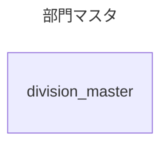
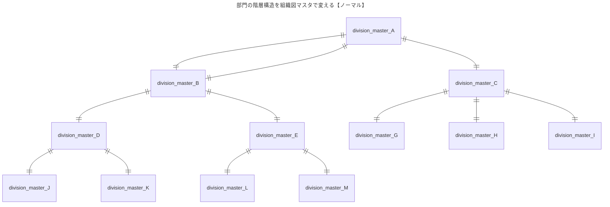
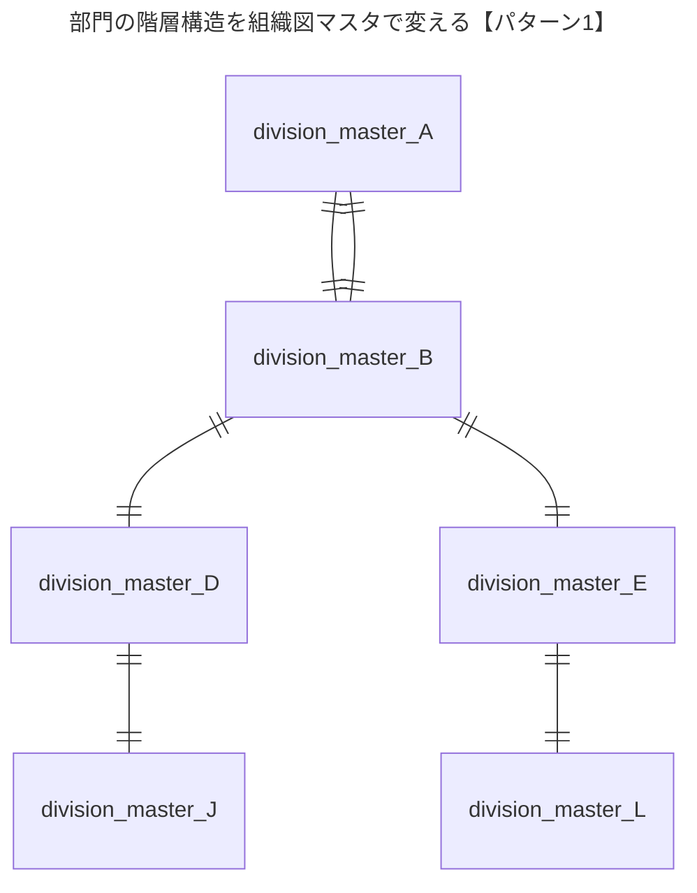
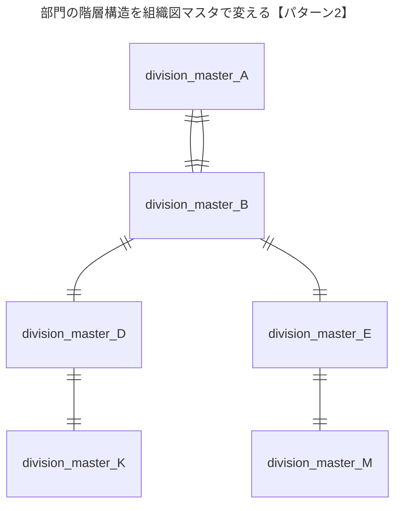

多対多の関係で





```
START TRANSACTION;
BEGIN;

CREATE TABLE organizational_chart_master (
  id INT AUTO_INCREMENT PRIMARY KEY NOT NULL,
  name VARCHAR(255) NOT NULL
);

COMMIT;
ROLLBACK;

CREATE TABLE division_master (
  id INT AUTO_INCREMENT PRIMARY KEY NOT NULL,
  division_id INT NOT NULL,
  name VARCHAR(255) NOT NULL,
  hierarchy INT NOT NULL,
  division_master_id INT,
  status INT NOT NULL DEFAULT 1,
  FOREIGN KEY (division_master_id) REFERENCES division_master(id)
);

CREATE TABLE organizational_chart (
  id INT AUTO_INCREMENT PRIMARY KEY NOT NULL,
  division_master_id INT NOT NULL,
  organizational_chart_master_id INT NOT NULL,
  FOREIGN KEY (division_master_id) REFERENCES division_master(id),
  FOREIGN KEY (organizational_chart_master_id) REFERENCES organizational_chart(id)
);

INSERT INTO division_master (division_id, name, hierarchy, division_master_id)
VALUES
  (10000, '全社', 3, null),
  (11000, '営業本部', 2, 1),
  (12000, '管理本部', 2, 1),
  (11100, '東日本営業部', 1, 2),
  (11200, '西日本営業部', 1, 2),
  (11101, '営業1課', 0, 4),
  (11102, '営業2課', 0, 4),
  (11103, '営業3課', 0, 5),
  (11104, '営業4課', 0, 5);

CREATE TABLE sales (
  id INT AUTO_INCREMENT PRIMARY KEY NOT NULL,
  division_master_id INT NOT NULL,
  sale_date DATE NOT NULL,
  amount INT NOT NULL,
  FOREIGN KEY (division_master_id) REFERENCES division_master(id) ON DELETE CASCADE
);

INSERT INTO sales (division_master_id, sale_date, amount)
SELECT 
  FLOOR(RAND() * 4) + 6,
  DATE_ADD('2023-01-01', INTERVAL FLOOR(RAND() * 365) DAY),
  FLOOR(RAND() * (1000000 - 1000 + 1)) + 1000
FROM
  (SELECT 1 UNION SELECT 2 UNION SELECT 3 UNION SELECT 4 UNION SELECT 5 UNION
  SELECT 6 UNION SELECT 7 UNION SELECT 8 UNION SELECT 9 UNION SELECT 10) t1,
  (SELECT 1 UNION SELECT 2 UNION SELECT 3 UNION SELECT 4 UNION SELECT 5 UNION
  SELECT 6 UNION SELECT 7 UNION SELECT 8 UNION SELECT 9 UNION SELECT 10) t2,
  (SELECT 1 UNION SELECT 2 UNION SELECT 3 UNION SELECT 4 UNION SELECT 5 UNION 
  SELECT 6 UNION SELECT 7 UNION SELECT 8 UNION SELECT 9 UNION SELECT 10) t3,
  (SELECT 1 UNION SELECT 2 UNION SELECT 3 UNION SELECT 4 UNION SELECT 5 UNION 
  SELECT 6 UNION SELECT 7 UNION SELECT 8 UNION SELECT 9 UNION SELECT 10) t4,
  (SELECT 1 UNION SELECT 2 UNION SELECT 3 UNION SELECT 4 UNION SELECT 5 UNION 
  SELECT 6 UNION SELECT 7 UNION SELECT 8 UNION SELECT 9 UNION SELECT 10) t5;

INSERT INTO organizational_chart_master (name)
VALUES
  ("通常"),
  ("パターン1"),
  ("パターン2");

INSERT INTO organizational_chart (division_master_id, organizational_chart_master_id)
VALUES
  (1, 1),
  (2, 1),
  (3, 1),
  (4, 1),
  (5, 1),
  (6, 1),
  (7, 1),
  (8, 1),
  (9, 1);
INSERT INTO organizational_chart (division_master_id, organizational_chart_master_id)
VALUES
  (1, 2),
  (2, 2),
  (3, 2),
  (4, 2),
  (5, 2),
  (7, 2),
  (8, 2);
INSERT INTO organizational_chart (division_master_id, organizational_chart_master_id)
VALUES
  (1, 3),
  (2, 3),
  (3, 3),
  (4, 3),
  (6, 3),
  (7, 3),
  (9, 3);
```
```
select * from organizational_chart_master where id = 2;
select * from organizational_chart where organizational_chart_master_id =
(select id from organizational_chart_master where id = 2);

select sum(amount) from sales where division_master_id in
(select division_master_id from organizational_chart where organizational_chart_master_id =
(select id from organizational_chart_master where id = 2)); 

select sum(amount) from sales where division_master_id in
(select division_master_id from organizational_chart where organizational_chart_master_id =
(select id from organizational_chart_master where id = 3)); 

```