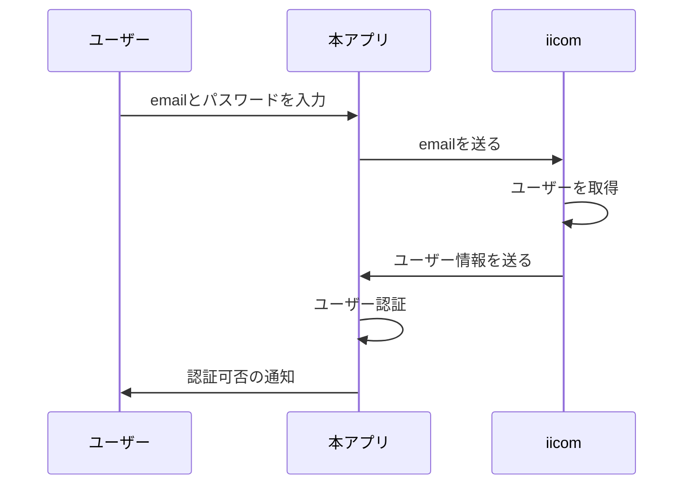
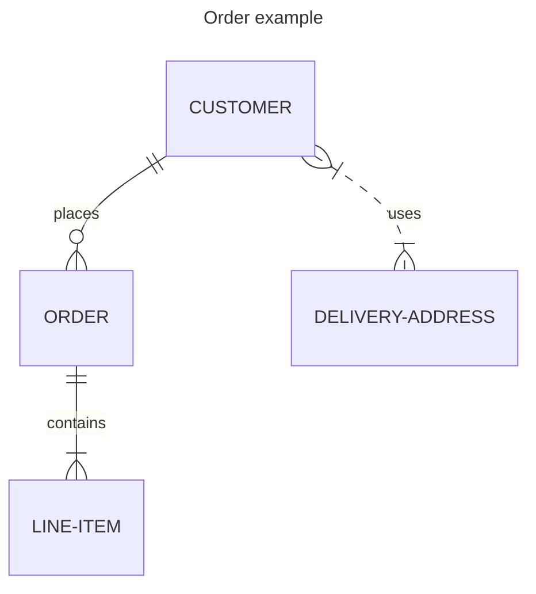
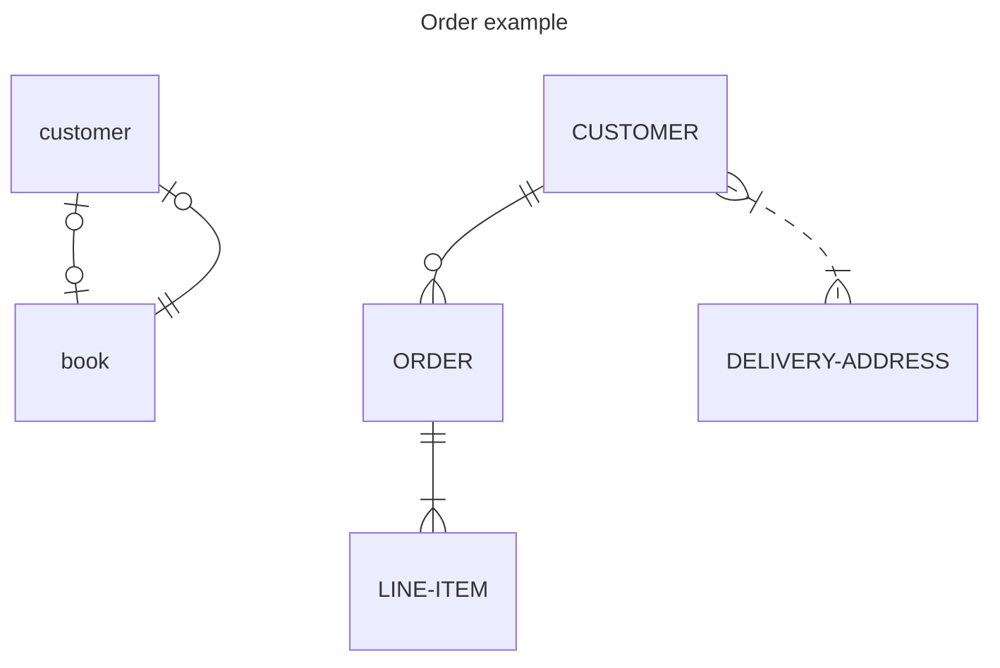

``` mermaid
sequenceDiagram
    participant user as ユーザー
    participant main as 本アプリ
    participant iicom as iicom

    user ->> main: emailとパスワードを入力
    main ->> iicom: emailを送る
    iicom ->> iicom: ユーザーを取得
    iicom ->> main: ユーザー情報を送る
    main ->> main: ユーザー認証
    main ->> user: 認証可否の通知

```

```mermaid
---
title: Order example
---
erDiagram
    CUSTOMER ||--o{ ORDER : places
    ORDER ||--|{ LINE-ITEM : contains
    CUSTOMER }|..|{ DELIVERY-ADDRESS : uses
```

```mermaid
---
title: Order example
---
erDiagram
  customer |o--o| book : ""
  customer |o--|| book : ""
  customer  
  CUSTOMER ||--o{ ORDER : ""
  ORDER ||--|{ LINE-ITEM: ""
  CUSTOMER }|..|{ DELIVERY-ADDRESS: ""
```