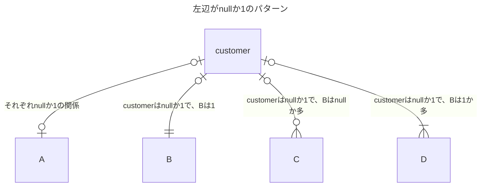
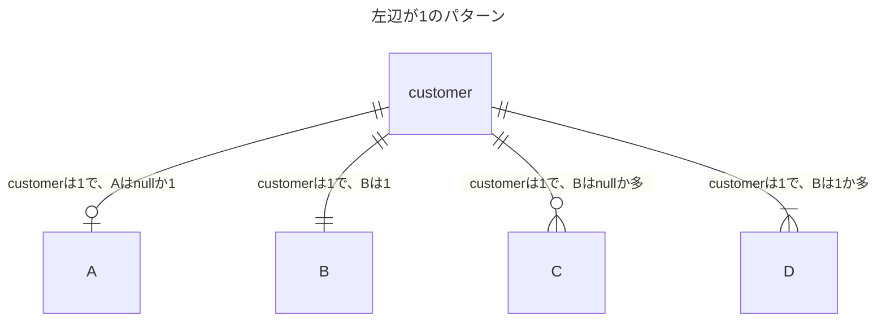
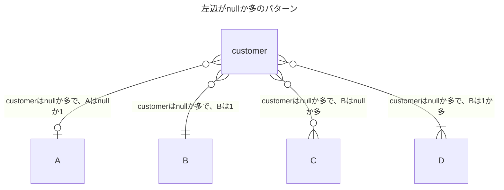
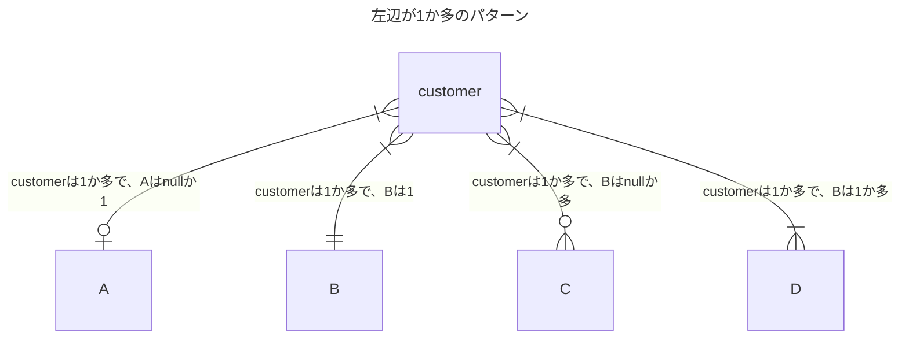

```mermaid
---
title: 左辺がnullか1のパターン
---
erDiagram
  customer |o--o| A : "それぞれnullか1の関係"
  customer |o--|| B : "customerはnullか1で、Bは1"
  customer |o--o{ C : "customerはnullか1で、Bはnullか多"
  customer |o--|{ D : "customerはnullか1で、Bは1か多"
```

```mermaid
---
title: 左辺が1のパターン
---
erDiagram
  customer ||--o| A : "customerは1で、Aはnullか1"
  customer ||--|| B : "customerは1で、Bは1"
  customer ||--o{ C : "customerは1で、Bはnullか多"
  customer ||--|{ D : "customerは1で、Bは1か多"
```

```mermaid
---
title: 左辺がnullか多のパターン
---
erDiagram
  customer }o--o| A : "customerはnullか多で、Aはnullか1"
  customer }o--|| B : "customerはnullか多で、Bは1"
  customer }o--o{ C : "customerはnullか多で、Bはnullか多"
  customer }o--|{ D : "customerはnullか多で、Bは1か多"
```

```mermaid
---
title: 左辺が1か多のパターン
---
erDiagram
  customer }|--o| A : "customerは1か多で、Aはnullか1"
  customer }|--|| B : "customerは1か多で、Bは1"
  customer }|--o{ C : "customerは1か多で、Bはnullか多"
  customer }|--|{ D : "customerは1か多で、Bは1か多"
```