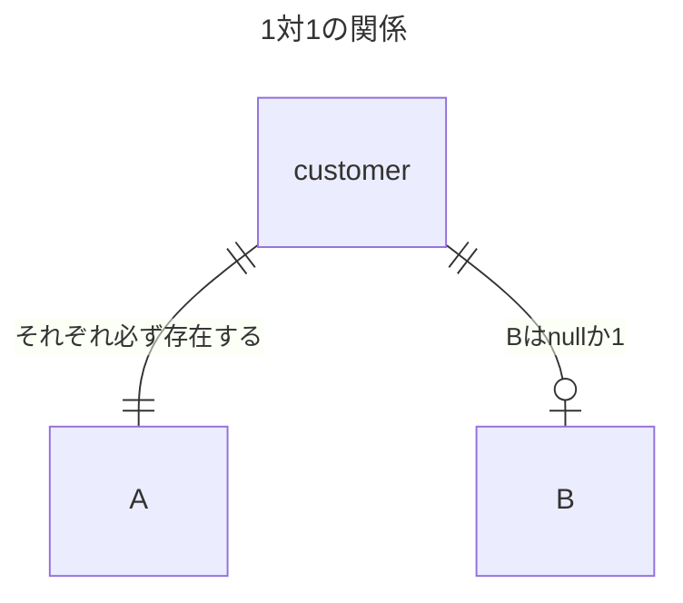
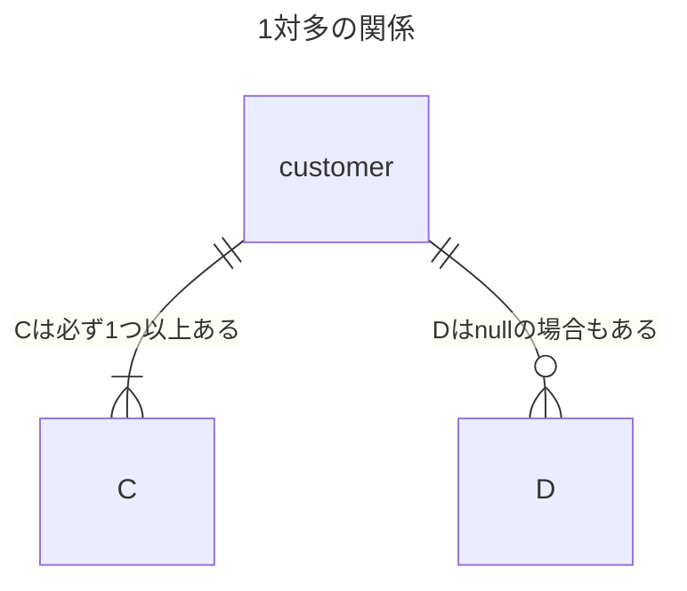

```mermaid
---
title: 1対1の関係
---
erDiagram
  customer ||--|| A : "それぞれ必ず存在する"
  customer ||--o| B : "Bはnullか1"
```

```mermaid
---
title: 1対多の関係
---
erDiagram
  customer ||--|{ C : "Cは必ず1つ以上ある"
  customer ||--o{ D : "Dはnullの場合もある"
```